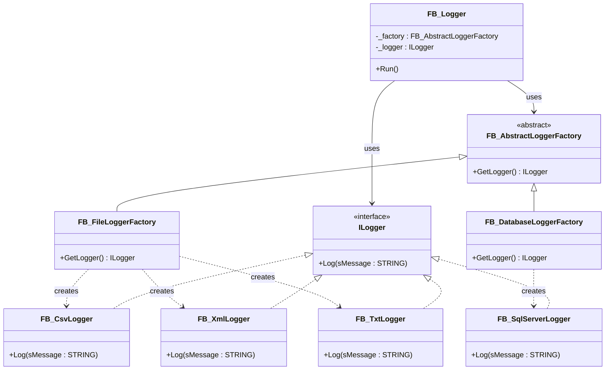

# Abstract Factory

**Category**: Creational  
**Folder**: `DesignPatterns/00_AbstractFactory`  
**Credit**: Stephen Henneken

## Intent

Provide an interface for creating *families* of related objects without specifying their concrete classes. The client requests loggers from a factory without knowing which concrete logger type it receives.

## PLC Context

The example models a logging subsystem. A `FB_AbstractLoggerFactory` base class defines the factory contract. Two concrete factory subclasses — `FB_FileLoggerFactory` and `FB_DatabaseLoggerFactory` — each produce loggers suited to their storage medium (CSV/TXT/XML files or SQL Server). All loggers share the `ILogger` interface so the client `FB_Logger` is decoupled from concrete types.

## Key Components

| Component | Role |
|---|---|
| `FB_AbstractLoggerFactory` | Abstract factory — declares `GetLogger()` |
| `FB_FileLoggerFactory` | Concrete factory — produces file-based loggers |
| `FB_DatabaseLoggerFactory` | Concrete factory — produces database loggers |
| `ILogger` | Product interface — `Log()` method |
| `FB_CsvLogger`, `FB_XmlLogger`, `FB_TxtLogger` | Concrete file products |
| `FB_SqlServerLogger` | Concrete database product |
| `FB_Logger` | Client — uses factory via `ILogger` reference |

## UML Diagram

