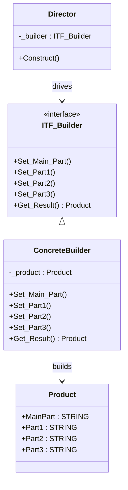

# Builder

**Category**: Creational  
**Folder**: `DesignPatterns/01_Builder`  
**Credit**: Armando Rene Narvaez Contreras → Alliazzz (CODESYS) → Kim Robbens (TwinCAT 3)

## Intent

Separate the construction of a complex object from its representation so that the same construction process can create different representations. A `Director` drives the build sequence; the concrete builder decides how each step is realised.

## PLC Context

A `Director` function block coordinates the assembly of a `Product` by calling builder steps in a fixed order: `Set_Main_Part` → `Set_Part1` → `Set_Part2` → `Set_Part3` → `Get_Result`. The `ConcreteBuilder` implements `ITF_Builder` and fills in the parts. Swapping the builder produces a structurally identical product with different internals.

## Key Components

| Component | Role |
|---|---|
| `ITF_Builder` | Builder interface — declares all construction steps |
| `ConcreteBuilder` | Implements each step; holds the `Product` under construction |
| `Director` | Calls steps in the required sequence |
| `Product` | The assembled complex object |

## UML Diagram

