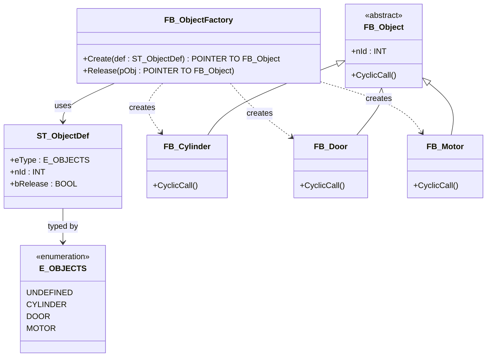

# Factory Method

**Category**: Creational  
**Folder**: `DesignPatterns/02_FactoryPattern`  
**Credit**: Kim Robbens

## Intent

Define an interface for creating an object, but let the factory decide which class to instantiate. Clients request objects by type without knowing the concrete class — the factory encapsulates the `__NEW` allocation and returns a typed pointer.

## PLC Context

`FB_ObjectFactory` holds a `CASE` statement keyed on the `E_OBJECTS` enum (`CYLINDER`, `DOOR`, `MOTOR`). It allocates the requested type with `__NEW`, stores it behind a `POINTER TO FB_Object` base pointer, and returns it to the caller. An `ST_ObjectDef` structure carries the type id, instance id, and a release flag so the factory also handles disposal.

## Key Components

| Component | Role |
|---|---|
| `FB_ObjectFactory` | Factory — creates concrete objects via `__NEW` |
| `E_OBJECTS` | Enum — `UNDEFINED`, `CYLINDER`, `DOOR`, `MOTOR` |
| `ST_ObjectDef` | Value object — type + id + release flag |
| `FB_Object` | Abstract base class |
| `FB_Cylinder` | Concrete product |
| `FB_Door` | Concrete product |
| `FB_Motor` | Concrete product |

## UML Diagram

