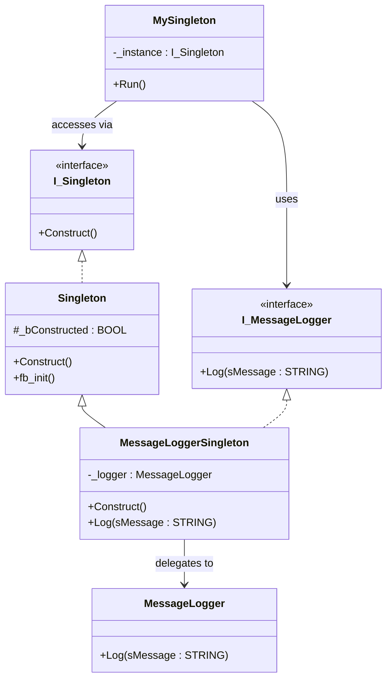

# Singleton by Proxy

**Category**: Creational  
**Folder**: `DesignPatterns/04_SingletonByProxy`  
**Credit**: Kim Robbens

## Intent

Guarantee that a class has only one instance and provide a controlled access point to it. The "by proxy" variant wraps the singleton behind a proxy so callers never hold a direct reference to the underlying object — they always go through the proxy, which enforces the single-instance invariant.

## PLC Context

`Singleton` is a base FB with `fb_init` / `Construct` lifecycle methods. `MessageLoggerSingleton` extends it and implements `I_MessageLogger`. Callers receive an `I_Singleton` reference and retrieve the logger through `I_MessageLogger`, never touching the concrete type directly.

## Key Components

| Component | Role |
|---|---|
| `I_Singleton` | Interface — lifecycle contract for singleton pattern |
| `I_MessageLogger` | Interface — product service contract |
| `Singleton` | Base FB — single-instance enforcement logic |
| `MessageLoggerSingleton` | Concrete singleton — implements `I_MessageLogger` |
| `MessageLogger` | The actual logging service wrapped by the singleton |
| `MySingleton` | Demo program / client |

## UML Diagram

