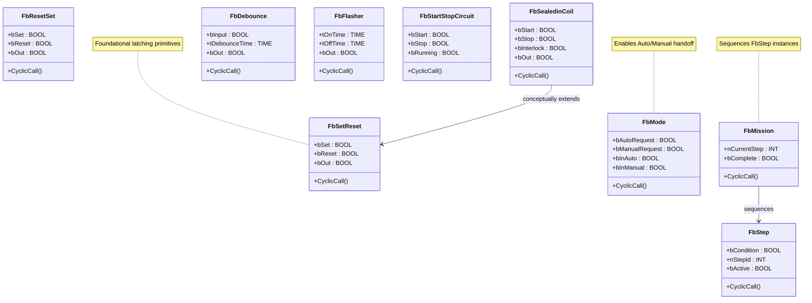

# Patterns of Ladder Logic Programming

**Category**: Auxiliary / Foundational  
**Folder**: `DesignPatterns/100_PatternsOfLadderLogicProgramming`  
**Credit**: Scott Whitlock (contactandcoil.com)

## Intent

Capture common, recurring constructs in ladder logic as reusable, self-contained function blocks. These are not GoF patterns but rather the fundamental building blocks of safe, maintainable PLC code.

## PLC Context

Each FB encapsulates one well-understood ladder pattern, making it testable in isolation and reusable across projects. Together they cover latching, sequencing, mode selection, timing, and I/O mapping — the vocabulary every PLC programmer needs.

## Included Patterns

| FB | Purpose |
|---|---|
| `FbSetReset` | SR latch — Set-dominant bistable |
| `FbResetSet` | RS latch — Reset-dominant bistable |
| `FbSealedinCoil` | Sealed-in coil — self-latching with interlock |
| `FbDebounce` | Input debounce — filters contact chatter |
| `FbFlasher` | Blinking output — configurable ON/OFF times |
| `FbStartStopCircuit` | Classic start/stop with seal |
| `FbMode` | Mode selector — Auto / Manual handoff |
| `FbStep` | Sequential step with condition-based advance |
| `FbMission` | Mission sequencer — ordered step list |
| `FbStateCoilFaultCoil` | State + fault coil pair |
| `FbInputMap` | Maps physical inputs to logical signals |
| `FbFiveRung` | Five-rung safety pattern (IEC-style) |

## UML Diagram

