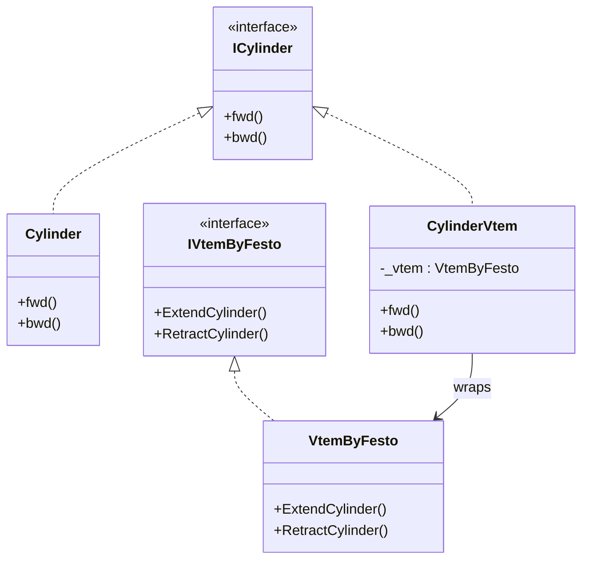

# Adapter

**Category**: Structural  
**Folder**: `DesignPatterns/10_Adapter`  
**Credit**: Kim Robbens

## Intent

Convert the interface of an existing class into another interface that clients expect. The adapter lets two incompatible interfaces work together without modifying either.

## PLC Context

The codebase already uses a standard `Cylinder` interface (`fwd()` / `bwd()`). A third-party Festo VTEM valve (`VtemByFesto`) exposes a different API (`IVtemByFesto`). `CylinderVtem` wraps `VtemByFesto` and translates `fwd()` / `bwd()` calls into the VTEM-specific API, so existing client code works unchanged.

## Key Components

| Component | Role |
|---|---|
| `ICylinder` | Target interface — `fwd()`, `bwd()` |
| `Cylinder` | Existing implementation of the target interface |
| `IVtemByFesto` | Adaptee interface — third-party VTEM API |
| `VtemByFesto` | Third-party cylinder (the adaptee) |
| `CylinderVtem` | Adapter — implements `ICylinder`, delegates to `VtemByFesto` |

## UML Diagram

