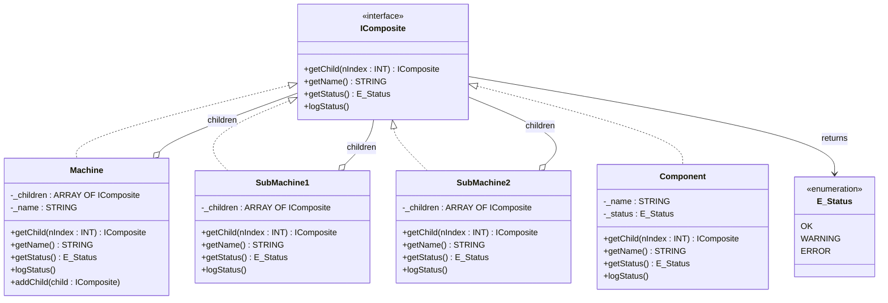

# Composite

**Category**: Structural  
**Folder**: `DesignPatterns/12_Composite`  
**Credit**: Kim Robbens

## Intent

Compose objects into tree structures to represent part–whole hierarchies. Clients treat individual objects and compositions uniformly through a common interface.

## PLC Context

An automation system has a `Machine` that contains sub-machines (`SubMachine1`, `SubMachine2`), which in turn contain leaf `Component` objects. Every node implements `IComposite` so that operations like `getStatus()` and `logStatus()` recurse naturally through the tree without the client needing to know the depth.

## Key Components

| Component | Role |
|---|---|
| `IComposite` | Common interface — `getChild()`, `getName()`, `getStatus()`, `logStatus()` |
| `Machine` | Composite node — holds an array of `IComposite` children |
| `SubMachine1`, `SubMachine2` | Intermediate composite nodes |
| `Component` | Leaf — no children, implements `IComposite` directly |
| `E_Status` | Enum — `OK`, `WARNING`, `ERROR` |

## UML Diagram

