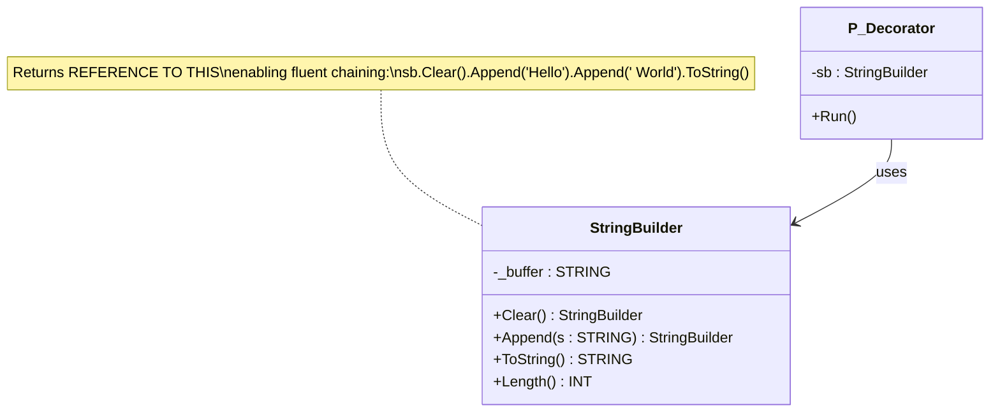

# Decorator

**Category**: Structural  
**Folder**: `DesignPatterns/13_Decorator`  
**Credit**: TcOpenGroup

## Intent

Attach additional responsibilities to an object dynamically. Decorators provide a flexible alternative to sub-classing for extending functionality.

## PLC Context

`StringBuilder` wraps a raw string buffer and adds a fluent, chainable interface. Each method (`Clear`, `Append`, `ToString`) returns the `StringBuilder` reference itself, allowing calls to be chained in a single expression. This is the decorator pattern applied to a primitive — the string — to give it richer behaviour without changing the underlying data type.

## Key Components

| Component | Role |
|---|---|
| `StringBuilder` | Decorator FB — wraps a `STRING` and adds a fluent interface |
| `P_Decorator` | Client program — demonstrates method chaining |

## UML Diagram

