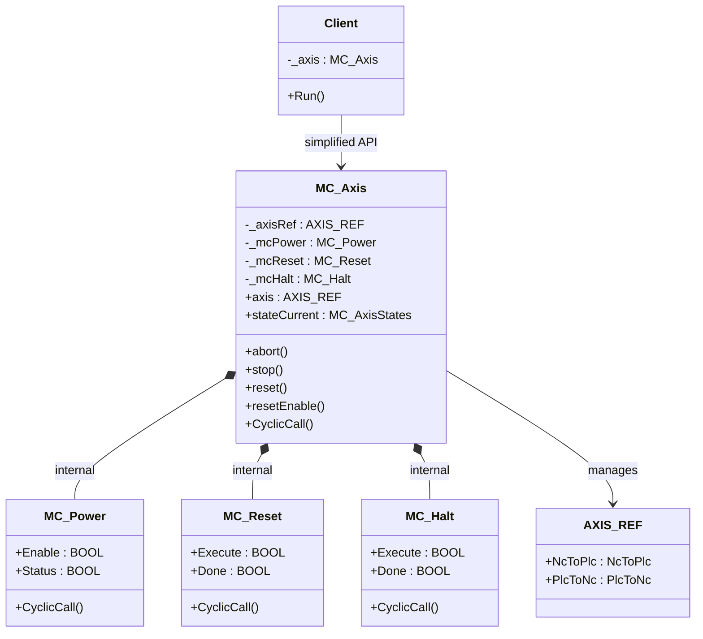

# Facade

**Category**: Structural  
**Folder**: `DesignPatterns/14_Facade`  
**Credit**: Kim Robbens

## Intent

Provide a simplified, unified interface to a complex subsystem. The facade hides internal complexity and reduces coupling between clients and the subsystem.

## PLC Context

TwinCAT motion control requires orchestrating multiple function blocks (`MC_Power`, `MC_Reset`, `MC_Halt`) and managing `AXIS_REF` state across scan cycles. `MC_Axis` acts as the facade — it handles all that internally and exposes a handful of clean methods (`abort`, `stop`, `reset`, `resetEnable`) and a `stateCurrent` property, so application code never has to deal with `MC_*` blocks directly.

## Key Components

| Component | Role |
|---|---|
| `MC_Axis` | Facade — simple API over the TwinCAT MC2 subsystem |
| `MC_Power` | Internal subsystem FB — axis power management |
| `MC_Reset` | Internal subsystem FB — error reset |
| `MC_Halt` | Internal subsystem FB — controlled stop |
| `AXIS_REF` | TwinCAT axis structure — shared between all MC blocks |

## UML Diagram

