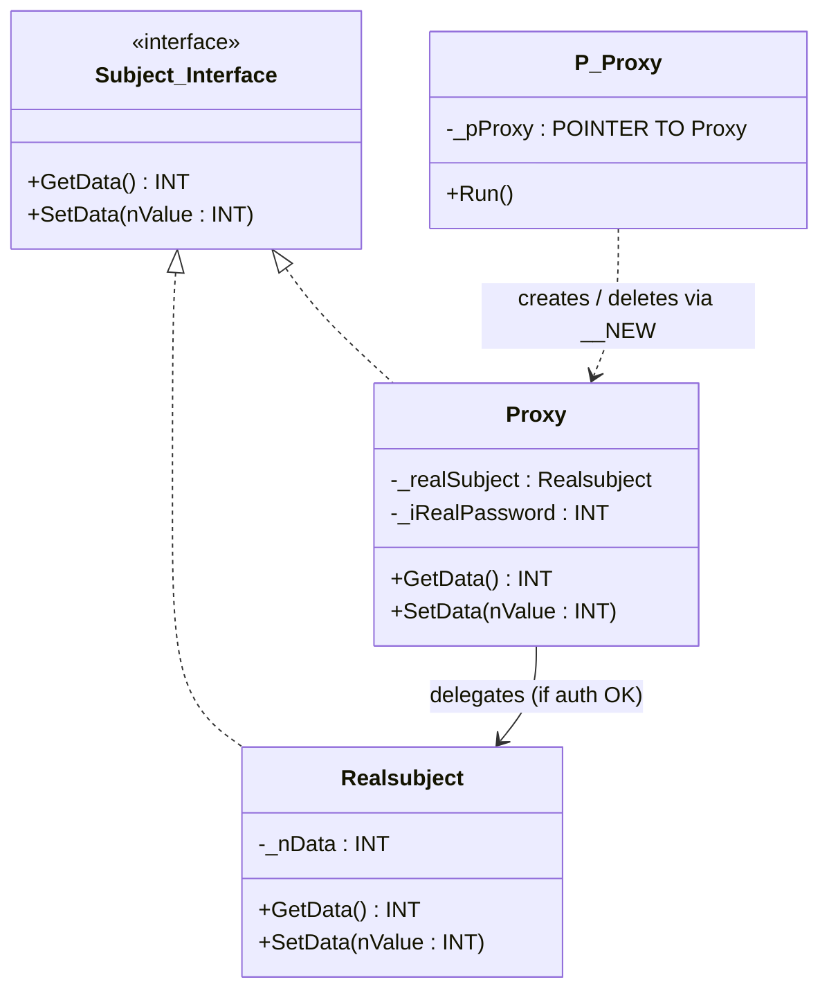

# Proxy

**Category**: Structural  
**Folder**: `DesignPatterns/16_Proxy`  
**Credit**: Armando Rene Narvaez Contreras → Alliazzz (CODESYS) → Kim Robbens (TwinCAT 3)

## Intent

Provide a surrogate or placeholder for another object to control access to it. The proxy intercepts calls and can add authentication, lazy initialisation, logging, or other cross-cutting concerns.

## PLC Context

`Realsubject` holds sensitive data. `Proxy` sits in front of it and requires a password (`iRealPassword`) before forwarding GET/SET requests. The client (`P_Proxy`) creates proxies dynamically with `__NEW` and releases them with `DELETE`. Both `Proxy` and `Realsubject` implement `Subject_Interface` so the client cannot distinguish them by type.

## Key Components

| Component | Role |
|---|---|
| `Subject_Interface` | Common interface — GET/SET data methods |
| `Realsubject` | Real subject — holds protected data |
| `Proxy` | Proxy — validates password before delegating to `Realsubject` |
| `P_Proxy` | Client — creates proxies dynamically |

## UML Diagram

