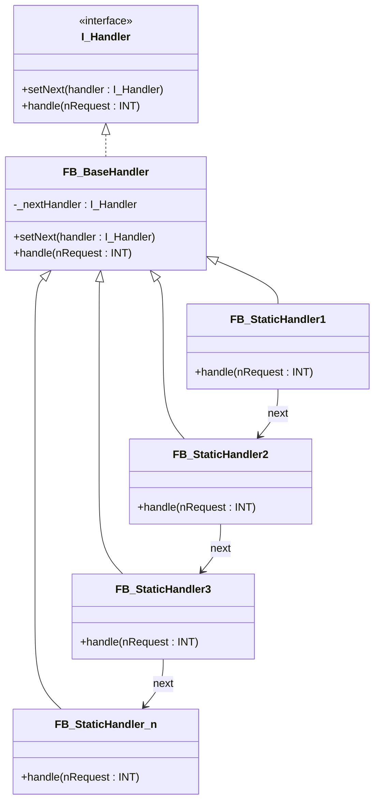

# Chain of Responsibility

**Category**: Behavioral  
**Folder**: `DesignPatterns/20_ChainOfResponsibility`  
**Credit**: 0w8states

## Intent

Avoid coupling the sender of a request to its receiver by giving more than one object a chance to handle the request. Chain the receiving objects and pass the request along the chain until one of them handles it.

## PLC Context

Handlers (`FB_StaticHandler1..n`) are chained at initialisation time via `setNext()`. When a request arrives at `handle()`, each handler either processes it or forwards it to the next handler. `FB_BaseHandler` implements the default pass-through behaviour so concrete handlers only override what they care about.

## Key Components

| Component | Role |
|---|---|
| `I_Handler` | Interface — `setNext()`, `handle()` |
| `FB_BaseHandler` | Base handler — stores `_nextHandler` ref, default pass-through `handle()` |
| `FB_StaticHandler1` | Concrete handler — handles specific request type |
| `FB_StaticHandler2` | Concrete handler |
| `FB_StaticHandler3` | Concrete handler |
| `FB_StaticHandler_n` | Terminal handler |

## UML Diagram

