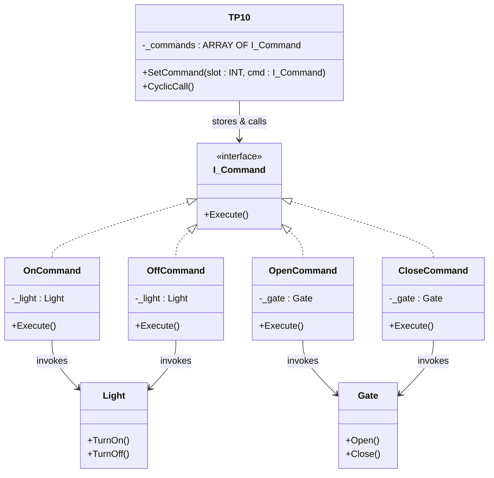

# Command

**Category**: Behavioral  
**Folder**: `DesignPatterns/21_Command`  
**Credit**: Kim Robbens

## Intent

Encapsulate a request as an object, thereby letting you parameterise clients with different requests, queue or log requests, and support undoable operations.

## PLC Context

Physical receivers (`Light`, `Gate`) perform the actual work. Commands (`OnCommand`, `OffCommand`, `OpenCommand`, `CloseCommand`) each reference a receiver and implement `I_Command.Execute()`. The invoker `TP10` holds an array of commands wired to button inputs; on each scan it calls `CyclicCall()` which fires the correct command when a button edge is detected.

## Key Components

| Component | Role |
|---|---|
| `I_Command` | Command interface — `Execute()` |
| `OnCommand` | Concrete command — calls `Light.TurnOn()` |
| `OffCommand` | Concrete command — calls `Light.TurnOff()` |
| `OpenCommand` | Concrete command — calls `Gate.Open()` |
| `CloseCommand` | Concrete command — calls `Gate.Close()` |
| `Light` | Receiver — light actuator |
| `Gate` | Receiver — gate actuator |
| `TP10` | Invoker — 10-button panel, holds `ARRAY[1..10] OF I_Command` |

## UML Diagram

