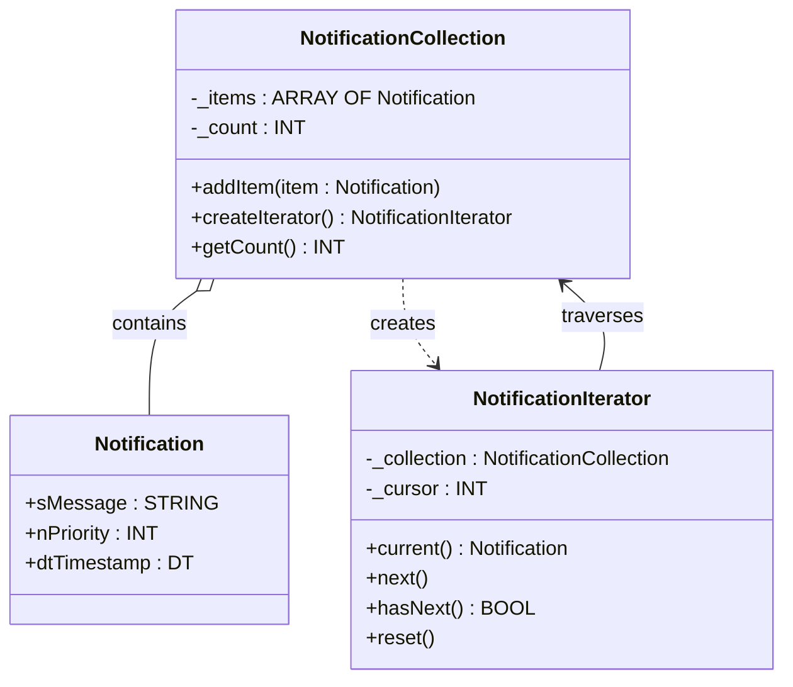

# Iterator

**Category**: Behavioral  
**Folder**: `DesignPatterns/23_Iterator`  
**Credit**: 0w8states

## Intent

Provide a way to access the elements of an aggregate object sequentially without exposing its underlying representation.

## PLC Context

`NotificationCollection` holds an internal array of `Notification` items and exposes `createIterator()`. The returned `NotificationIterator` maintains a cursor and provides `current()`, `next()`, `hasNext()`, and `reset()` so consumers can traverse notifications without knowing the storage structure.

## Key Components

| Component | Role |
|---|---|
| `NotificationCollection` | Aggregate — stores `Notification` items, creates iterators |
| `NotificationIterator` | Iterator — cursor-based traversal over the collection |
| `Notification` | Element — individual notification item |

## UML Diagram

