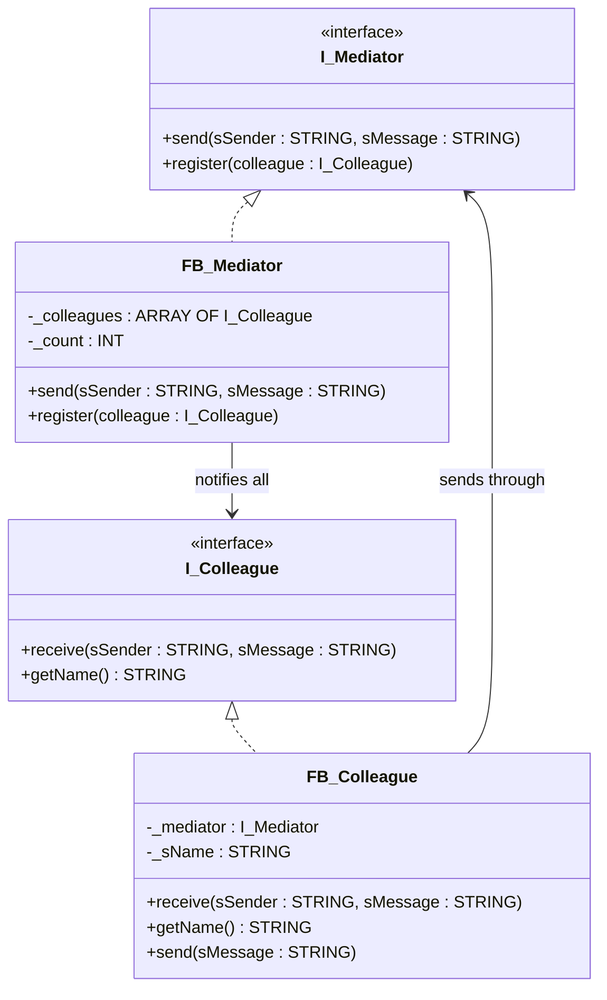

# Mediator

**Category**: Behavioral  
**Folder**: `DesignPatterns/24_Mediator`  
**Credit**: 0w8states

## Intent

Define an object that encapsulates how a set of objects interact. The mediator promotes loose coupling by keeping objects from referring to each other explicitly, and allows varying their interaction independently.

## PLC Context

The example models a chat room. `FB_Colleague` instances (users) register with `FB_Mediator` and send messages through it. The mediator broadcasts each message to every other registered colleague. Colleagues never communicate directly — all traffic flows through the mediator, so adding or removing a participant does not affect others.

## Key Components

| Component | Role |
|---|---|
| `I_Mediator` | Mediator interface — `send()`, `register()` |
| `FB_Mediator` | Concrete mediator — routes messages to all colleagues |
| `I_Colleague` | Colleague interface — `receive()`, `getName()` |
| `FB_Colleague` | Concrete colleague — registers with mediator, sends/receives messages |

## UML Diagram

