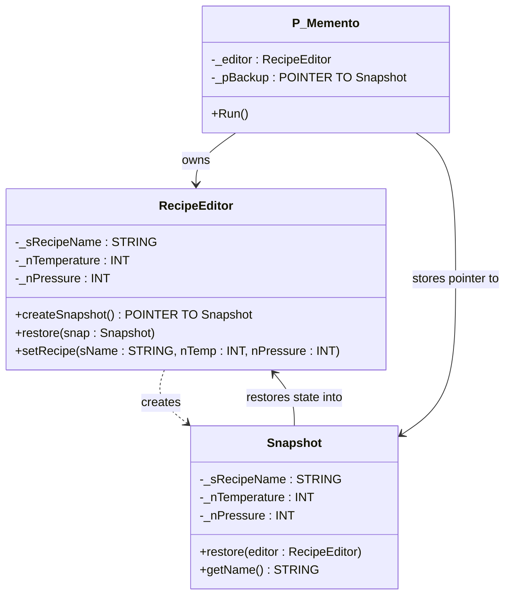

# Memento

**Category**: Behavioral  
**Folder**: `DesignPatterns/25_Memento`  
**Credit**: 0w8states

## Intent

Without violating encapsulation, capture and externalise an object's internal state so that the object can be restored to this state later.

## PLC Context

`RecipeEditor` (the originator) manages a recipe. Calling `createSnapshot()` produces a `Snapshot` memento containing a copy of the current recipe state. The caretaker (`P_Memento` program) stores the snapshot pointer. When the user wants to undo, the caretaker calls `pBackup^.restore()` to push the saved state back into the editor — without ever accessing the editor's private fields directly.

## Key Components

| Component | Role |
|---|---|
| `RecipeEditor` | Originator — object whose state is snapshotted |
| `Snapshot` | Memento — opaque state capsule |
| `P_Memento` | Caretaker — stores and triggers restore |

## UML Diagram

