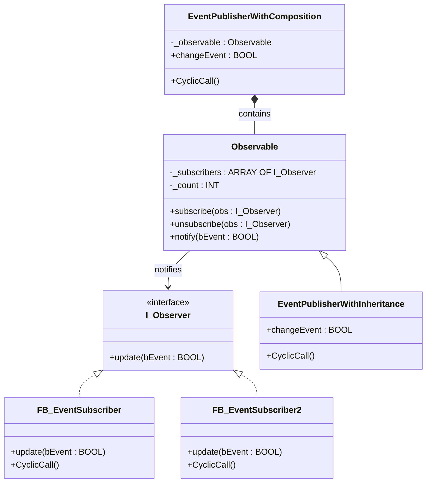

# Observer

**Category**: Behavioral  
**Folder**: `DesignPatterns/26_Observer`  
**Credit**: Kim Robbens

## Intent

Define a one-to-many dependency between objects so that when one object changes state, all its dependents are notified and updated automatically.

## PLC Context

Two publisher styles are provided side-by-side: `EventPublisherWithInheritance` extends `Observable` directly, while `EventPublisherWithComposition` embeds an `Observable` instance. Both trigger a `changeEvent` flag. Subscribers (`FB_EventSubscriber`, `FB_EventSubscriber2`) poll `CyclicCall()` on every scan and react when the flag changes, without polling the publisher internals.

## Key Components

| Component | Role |
|---|---|
| `I_Observer` | Observer interface — `update()` |
| `Observable` | Base observable — stores subscriber list, fires `notify()` |
| `EventPublisherWithInheritance` | Concrete publisher via inheritance |
| `EventPublisherWithComposition` | Concrete publisher via composition |
| `FB_EventSubscriber` | Concrete observer |
| `FB_EventSubscriber2` | Concrete observer (alternate reaction) |

## UML Diagram

