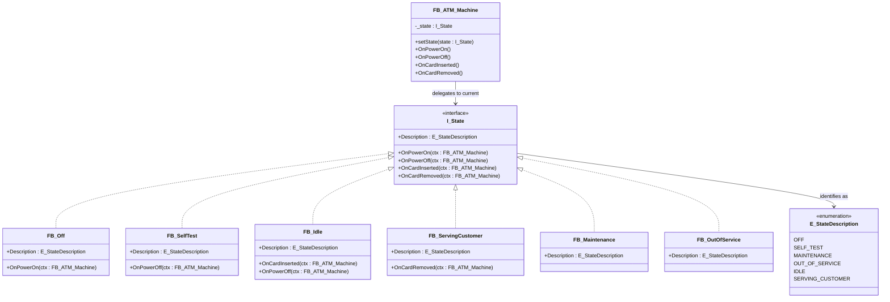

# State

**Category**: Behavioral  
**Folder**: `DesignPatterns/27_State`  
**Credit**: 0w8states

## Intent

Allow an object to alter its behaviour when its internal state changes. The object will appear to change its class.

## PLC Context

`FB_ATM_Machine` models a bank ATM. Each operating mode is a separate function block (`FB_Off`, `FB_SelfTest`, `FB_Maintenance`, `FB_OutOfService`, `FB_Idle`, `FB_ServingCustomer`) that implements `I_State`. The context holds a reference to the current state and delegates all button/sensor events to it. States are responsible for transitioning the context to the next state — no giant CASE statement required.

## Key Components

| Component | Role |
|---|---|
| `I_State` | State interface — `Description` property, event handlers |
| `FB_ATM_Machine` | Context — delegates to current `I_State` |
| `FB_Off` | State — powered off |
| `FB_SelfTest` | State — startup self-test |
| `FB_Maintenance` | State — maintenance mode |
| `FB_OutOfService` | State — out of service |
| `FB_Idle` | State — waiting for customer |
| `FB_ServingCustomer` | State — transaction in progress |
| `E_StateDescription` | Enum — state identifiers |

## UML Diagram

