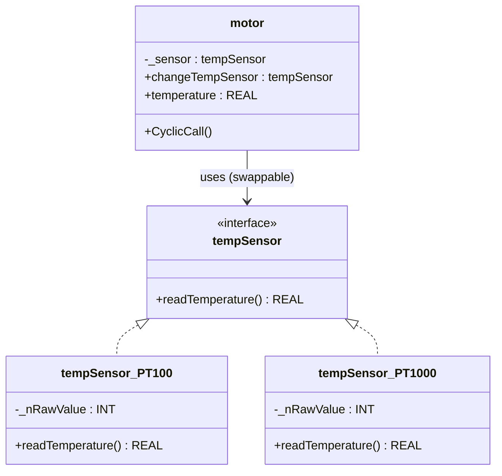

# Strategy

**Category**: Behavioral  
**Folder**: `DesignPatterns/28_Strategy`  
**Credit**: Kim Robbens

## Intent

Define a family of algorithms, encapsulate each one, and make them interchangeable. Strategy lets the algorithm vary independently from the clients that use it.

## PLC Context

A `motor` function block needs to read temperature from a sensor, but the sensor type (PT100 vs PT1000) may vary per installation or be changed at runtime. Each sensor type implements the same interface. The motor holds a reference and can switch strategies via the `changeTempSensor` property — no internal logic changes required.

## Key Components

| Component | Role |
|---|---|
| `tempSensor` (interface) | Strategy interface — `readTemperature()` |
| `tempSensor_PT100` | Concrete strategy — PT100 conversion algorithm |
| `tempSensor_PT1000` | Concrete strategy — PT1000 conversion algorithm |
| `motor` | Context — uses `tempSensor` reference |

## UML Diagram

