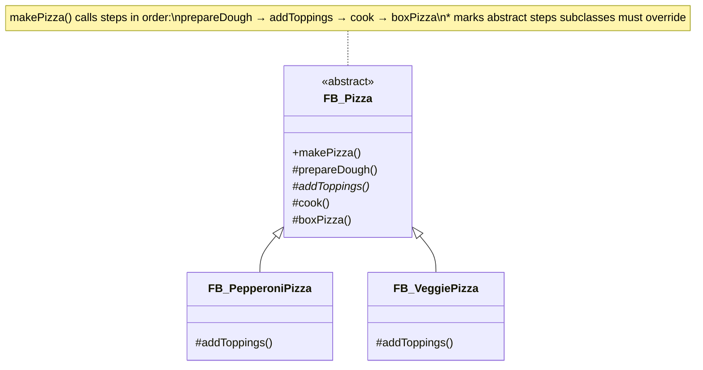

# Template Method

**Category**: Behavioral  
**Folder**: `DesignPatterns/29_TemplateMethod`  
**Credit**: 0w8states

## Intent

Define the skeleton of an algorithm in a base class, deferring some steps to subclasses. Template Method lets subclasses redefine certain steps of an algorithm without changing the algorithm's structure.

## PLC Context

`FB_Pizza` defines `makePizza()` — a fixed sequence: `prepareDough()` → `addToppings()` → `cook()` → `boxPizza()`. The base class provides default implementations for shared steps. `FB_PepperoniPizza` and `FB_VeggiePizza` override `addToppings()` (and optionally `cook()`) to customise their respective pizzas while the overall workflow stays in the base class.

## Key Components

| Component | Role |
|---|---|
| `FB_Pizza` | Abstract base — `makePizza()` template method |
| `FB_PepperoniPizza` | Concrete subclass — overrides `addToppings()` |
| `FB_VeggiePizza` | Concrete subclass — overrides `addToppings()` |

## UML Diagram

