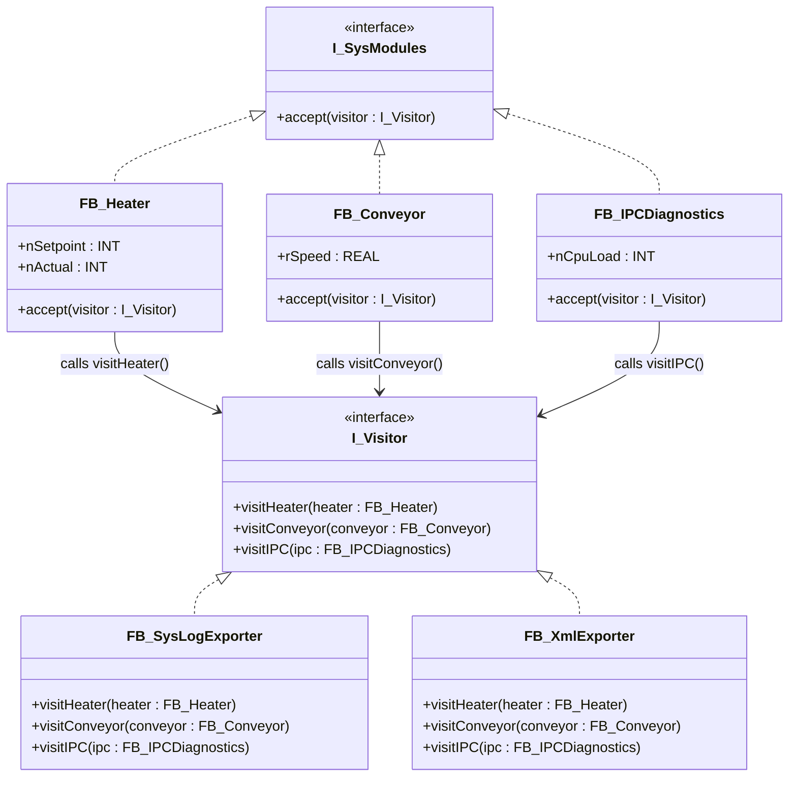

# Visitor

**Category**: Behavioral  
**Folder**: `DesignPatterns/30_Visitor`  
**Credit**: 0w8states

## Intent

Represent an operation to be performed on the elements of an object structure. Visitor lets you define a new operation without changing the classes of the elements on which it operates.

## PLC Context

System modules (`FB_Heater`, `FB_Conveyor`, `FB_IPCDiagnostics`) each implement `I_SysModules` with an `accept(visitor)` method. Two visitors are provided: `FB_SysLogExporter` (writes to syslog) and `FB_XmlExporter` (serialises to XML). Applying a visitor to the module array executes the visitor's logic on every module without touching the module FBs themselves.

## Key Components

| Component | Role |
|---|---|
| `I_Visitor` | Visitor interface — `visitHeater()`, `visitConveyor()`, `visitIPC()` |
| `I_SysModules` | Element interface — `accept(visitor : I_Visitor)` |
| `FB_SysLogExporter` | Concrete visitor — exports to syslog |
| `FB_XmlExporter` | Concrete visitor — exports to XML |
| `FB_Heater` | Concrete element — heater module |
| `FB_Conveyor` | Concrete element — conveyor module |
| `FB_IPCDiagnostics` | Concrete element — IPC diagnostics module |

## UML Diagram

